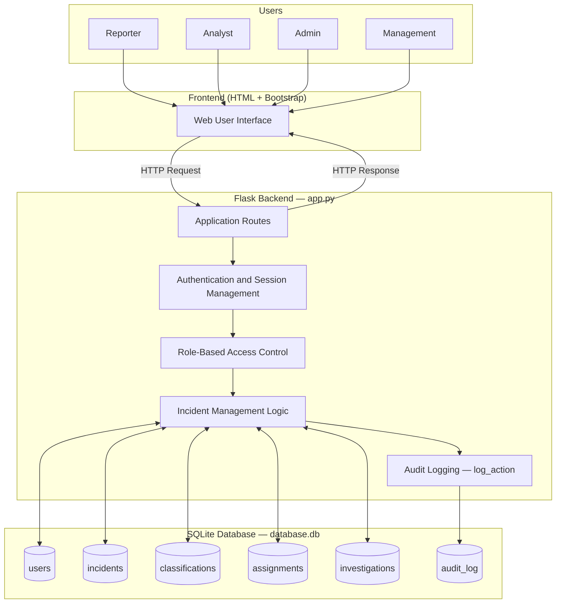
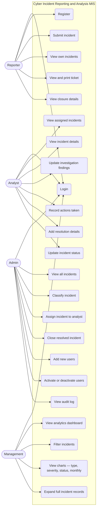
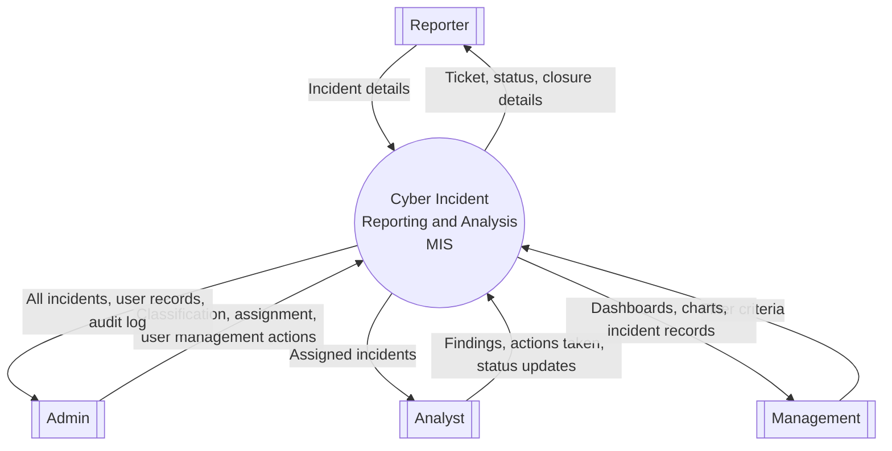
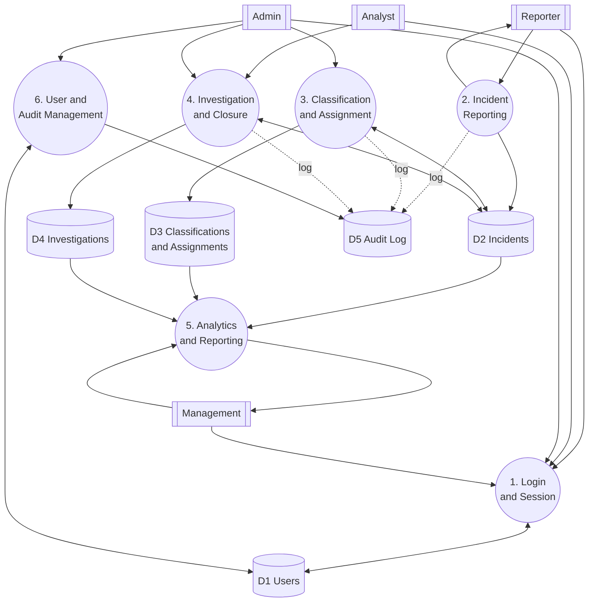
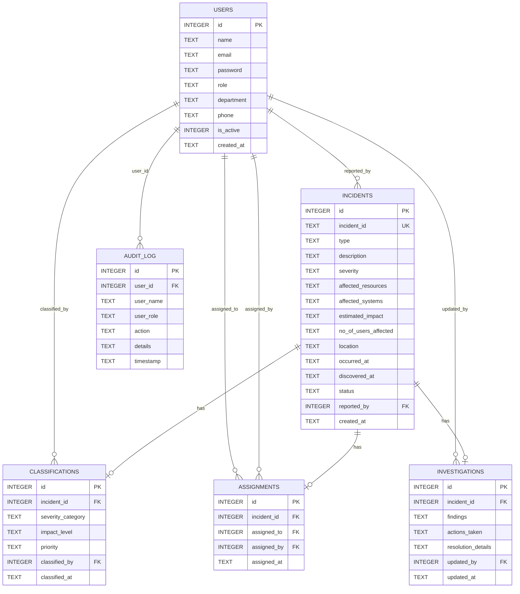
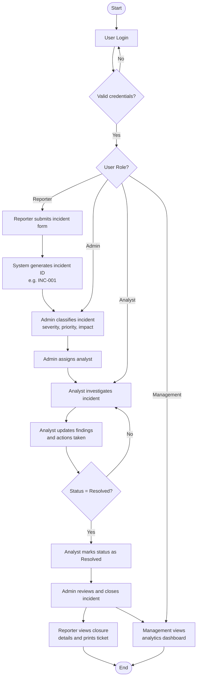
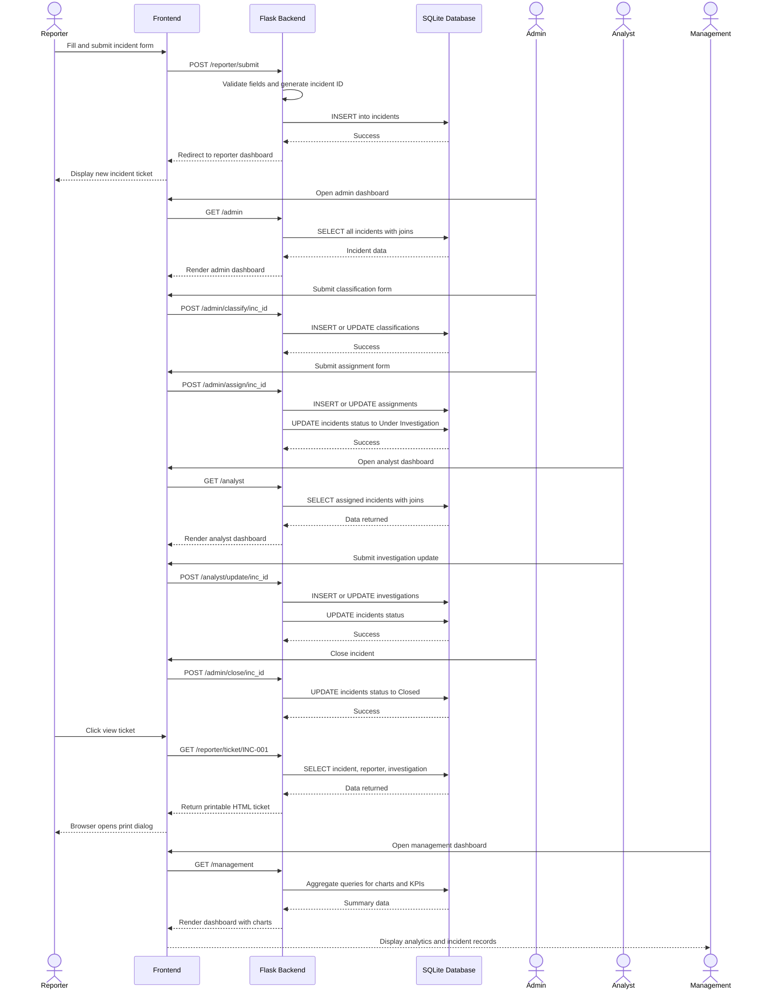
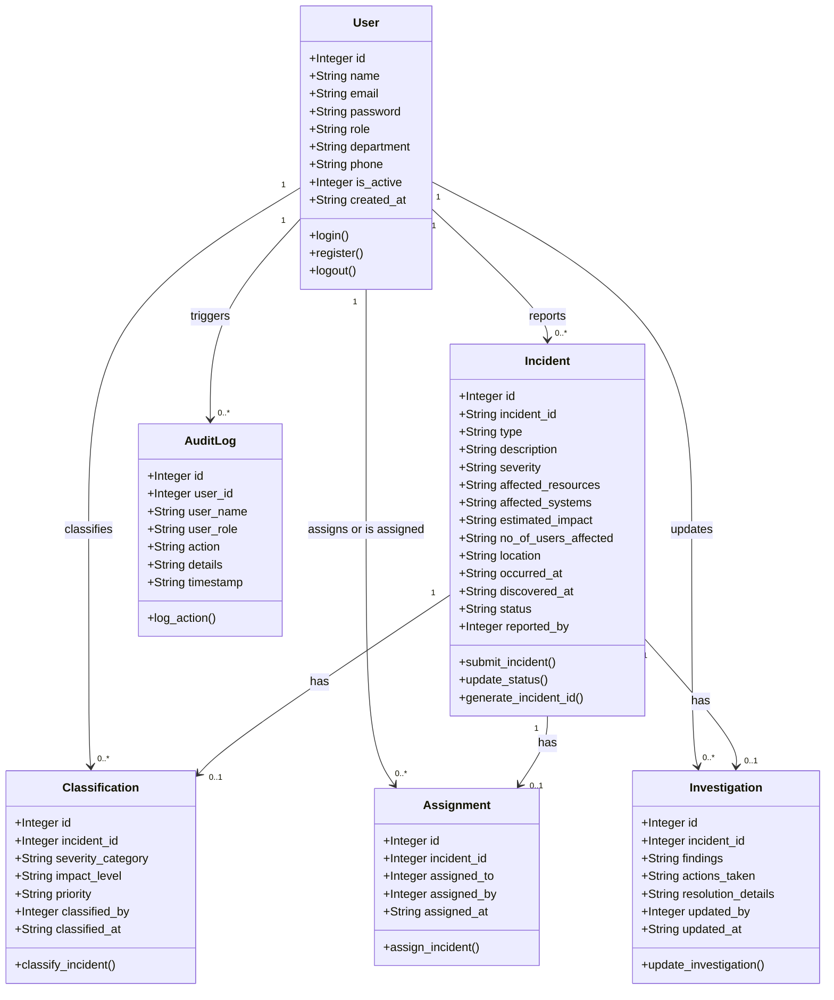
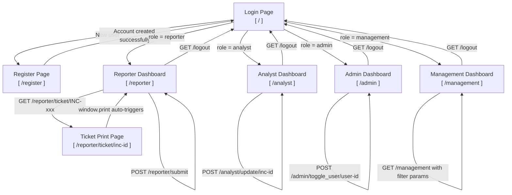

# Cyber Incident Reporting & Analysis MIS
## Diagrams for Academic Project Report

**Student:** Sourish Phate | **Roll No:** 231070072 | **Branch:** Third Year C.S. | **Batch:** C

> All diagrams are generated using [Mermaid.js](https://mermaid.live).  
> Paste each code block at [mermaid.live](https://mermaid.live) to render and export as PNG/SVG.

---

## Figure 1 — System Architecture Diagram

*Interaction between users, frontend, Flask backend, and SQLite database.*

---

## Figure 2 — Use Case Diagram

*Capabilities of each user role in the system.*

---

## Figure 3 — DFD Level 0 (Context Diagram)

*System boundary and external entity data flows.*

---

## Figure 4 — DFD Level 1

*Internal processes and data stores.*

---

## Figure 5 — ER Diagram

*SQLite database schema and all foreign key relationships (verified from init_db).*

---

## Figure 6 — Activity Diagram

*Lifecycle of an incident from submission to closure.*

---

## Figure 7 — Sequence Diagram

*Main workflow from incident reporting to closure and analytics.*

---

## Figure 8 — Logical Class Diagram

*System entities, attributes, and route-level operations.*

---

## Figure 9 — UI Screen Flow Diagram

*Navigation paths for each role based on session role check.*

---

*Generated for MIS Project — Cyber Incident Reporting & Analysis System*  
*Sourish Phate | Roll No: 231070072 | Third Year C.S. | Batch C*
