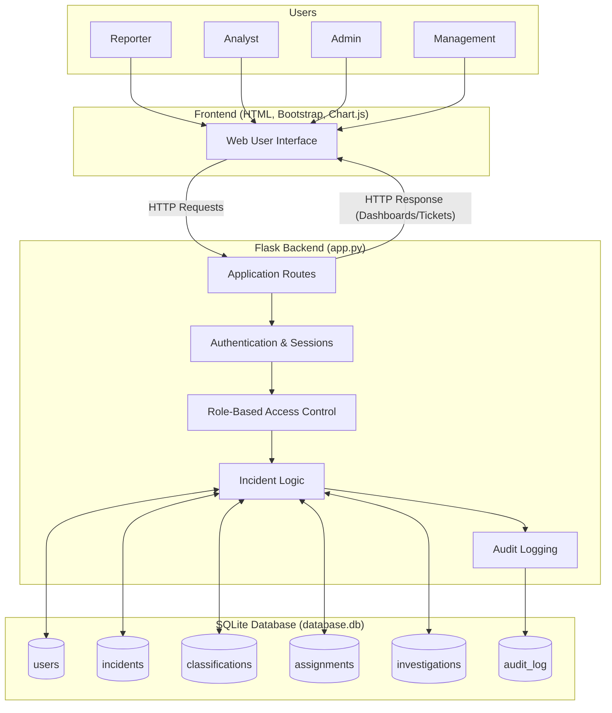
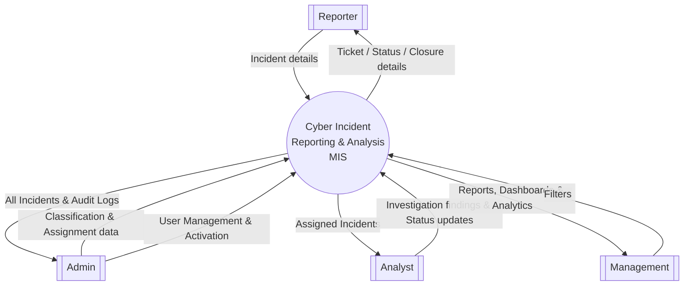
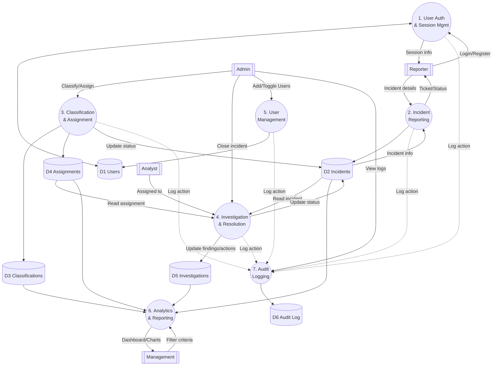
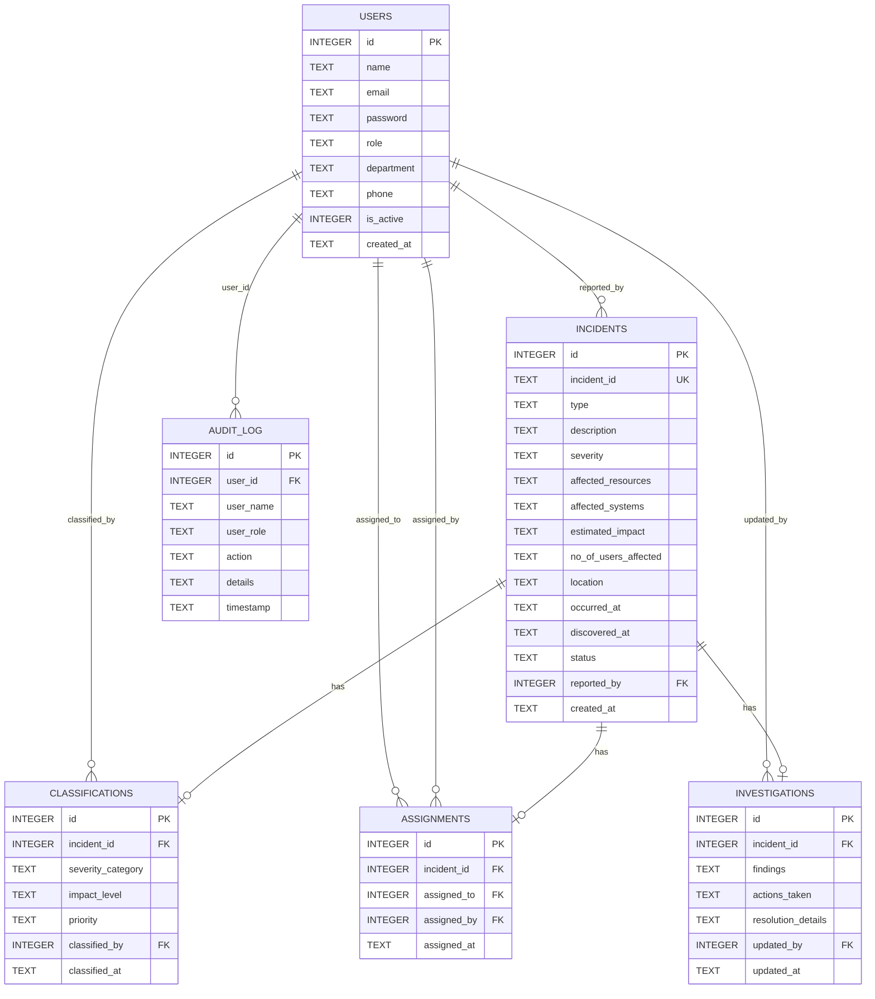
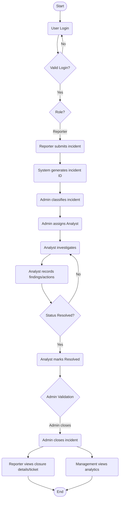
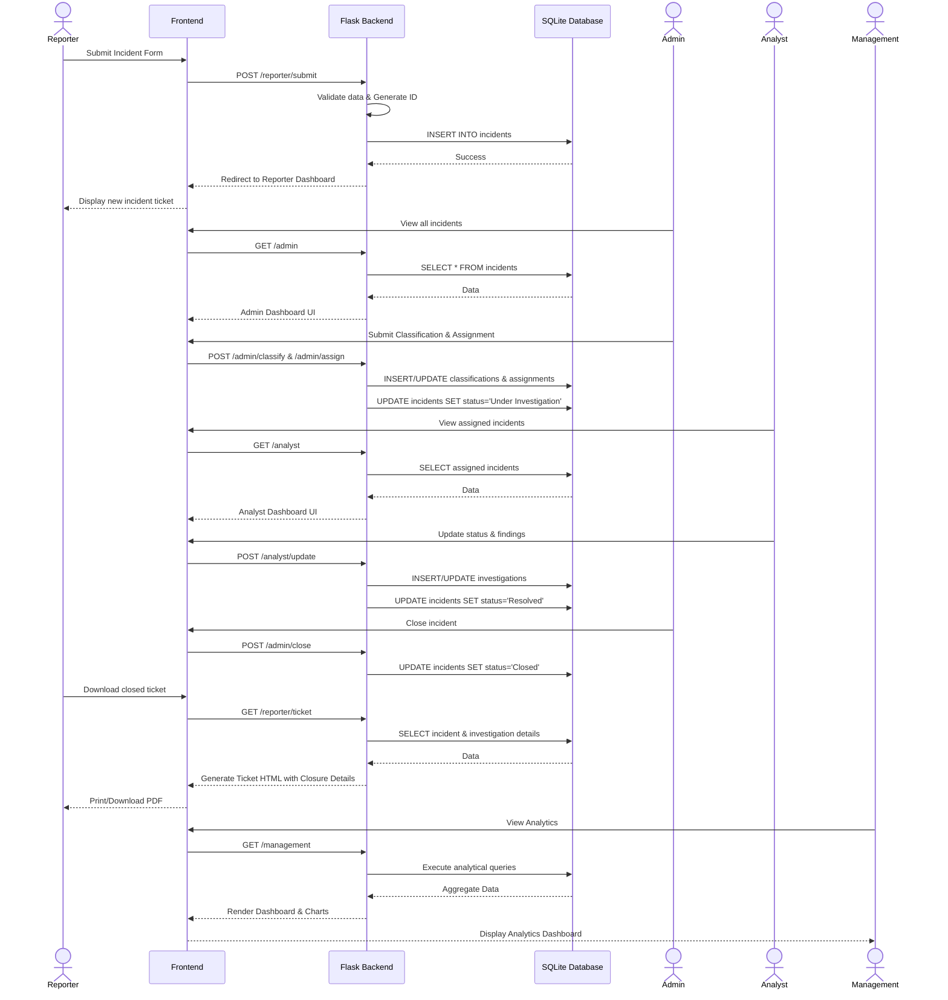
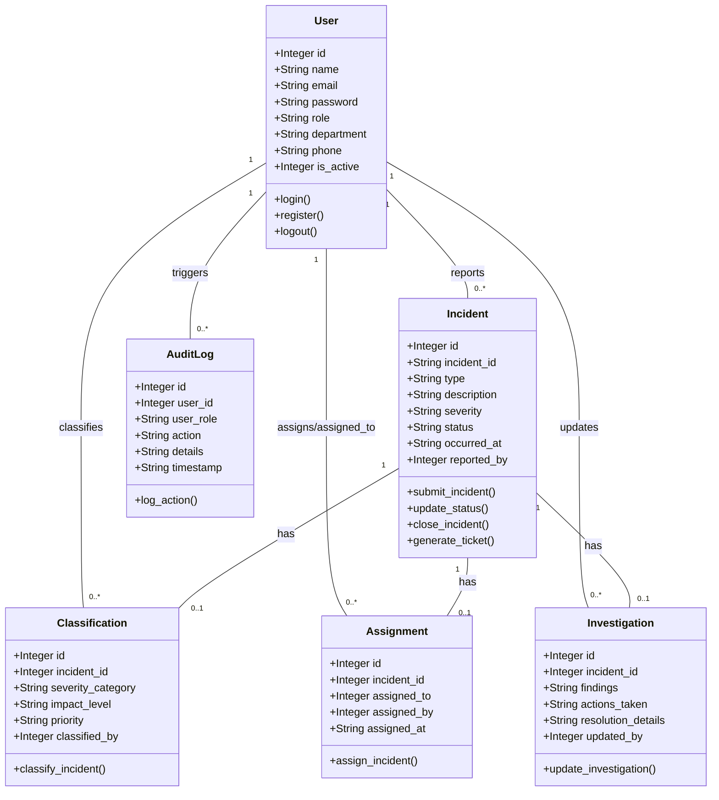
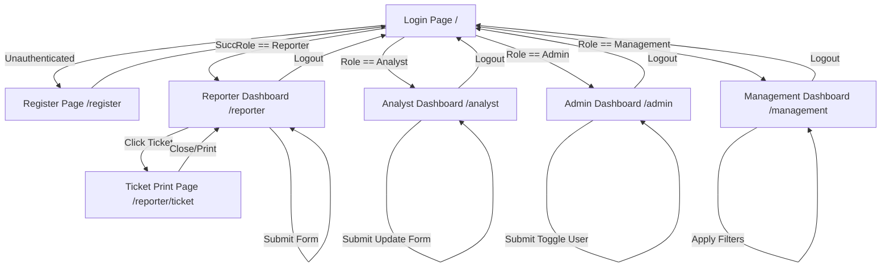

# Cyber Incident Reporting & Analysis Management Information System
## Academic Project Report Diagrams

This document contains the diagrams reverse-engineered from the Flask `app.py` codebase for the **Cyber Incident Reporting & Analysis Management Information System**.

All diagrams are generated using [Mermaid.js](https://mermaid-js.github.io/), which renders natively in standard Markdown viewers (like GitHub, GitLab, and most modern Markdown editors). You can right-click the rendered SVG graphs to save or export them as images (PNG/SVG) for your report.

---

### 1. System Architecture Diagram
**Figure 1:** *System Architecture showing interaction between Users, Frontend, Backend, and Database.*

---

### 2. Use Case Diagram
**Figure 2:** *Use Case Diagram outlining the capabilities of each user role.*

```mermaid
flowchart LR
    %% Actors
    Reporter([Reporter])
    Analyst([Analyst])
    Admin([Admin])
    Management([Management])

    %% Use Cases
    subgraph System ["Cyber Incident Reporting & Analysis MIS"]
        direction TB
        %% Reporter UCs
        UC_Login(Login)
        UC_Reg(Register)
        UC_SubInc(Submit incident)
        UC_ViewOwn(View own incidents)
        UC_Print(Print/download ticket)
        UC_ViewClosure(View closure details)

        %% Analyst UCs
        UC_ViewAssigned(View assigned incidents)
        UC_ViewIncDet(View incident details)
        UC_AddFind(Add investigation findings)
        UC_RecAct(Record actions taken)
        UC_AddRes(Add resolution details)
        UC_UpdStat(Update status)

        %% Admin UCs
        UC_ViewAll(View all incidents)
        UC_Classify(Classify incident)
        UC_Assign(Assign incident to analyst)
        UC_Close(Close resolved incident)
        UC_AddUser(Add users)
        UC_TogUser(Activate/deactivate users)
        UC_ViewAud(View audit log)

        %% Mgmt UCs
        UC_ViewDash(View analytics dashboard)
        UC_Filter(Filter incidents)
        UC_ViewCharts(View charts)
        UC_ExpRep(Expand incident records)
    end

    Reporter --> UC_Login
    Reporter --> UC_Reg
    Reporter --> UC_SubInc
    Reporter --> UC_ViewOwn
    Reporter --> UC_Print
    Reporter --> UC_ViewClosure

    Analyst --> UC_Login
    Analyst --> UC_ViewAssigned
    Analyst --> UC_ViewIncDet
    Analyst --> UC_AddFind
    Analyst --> UC_RecAct
    Analyst --> UC_AddRes
    Analyst --> UC_UpdStat

    Admin --> UC_Login
    Admin --> UC_ViewAll
    Admin --> UC_Classify
    Admin --> UC_Assign
    Admin --> UC_Close
    Admin --> UC_AddUser
    Admin --> UC_TogUser
    Admin --> UC_ViewAud

    Management --> UC_Login
    Management --> UC_ViewDash
    Management --> UC_Filter
    Management --> UC_ViewCharts
    Management --> UC_ExpRep
```

---

### 3. DFD Level 0 / Context Diagram
**Figure 3:** *Context Diagram (DFD Level 0) illustrating the system boundary and external entities.*

---

### 4. DFD Level 1
**Figure 4:** *DFD Level 1 displaying internal processes and data stores.*

---

### 5. ER Diagram
**Figure 5:** *Entity-Relationship Diagram depicting the SQLite database schema and foreign key relationships.*

---

### 6. Activity Diagram
**Figure 6:** *Activity Diagram showing the lifecycle of an incident and system decision points.*

---

### 7. Sequence Diagram
**Figure 7:** *Sequence Diagram for the main workflow from reporting to closure and analytics.*

---

### 8. Logical Class Diagram
**Figure 8:** *Logical Class Diagram representing the system entities, attributes, and route operations.*

---

### 9. UI Navigation / Screen Flow Diagram
**Figure 9:** *Screen Flow Diagram showing navigation paths based on user roles.*

